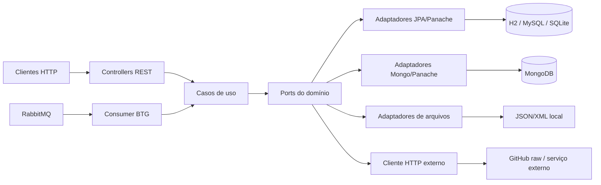
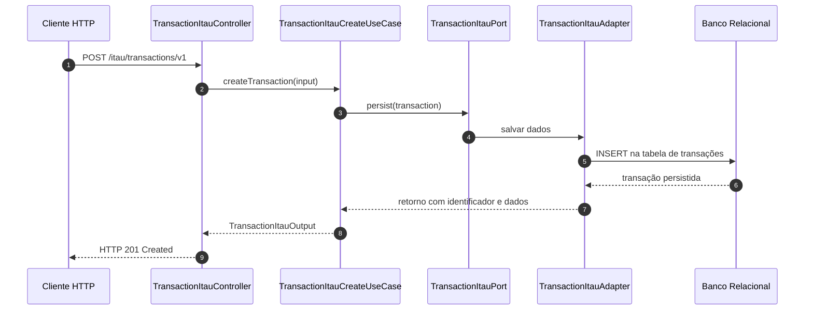

# Arquitetura do Projeto

## 1. Objetivo

Este repositório implementa uma aplicação de demonstração e estudo em Quarkus, com foco em arquitetura limpa e em múltiplos contextos de negócio, cada um com regras, persistência e integrações específicas. A solução reúne três desafios distintos:

- Itaú: criação, consulta, remoção e estatísticas de transações;
- UOL: cadastro e consulta de jogadores, com obtenção de grupos de heróis a partir de arquivo local ou API externa;
- BTG Pactual: criação e consulta de pedidos, agregação por cliente e processamento assíncrono via RabbitMQ.

A aplicação expõe endpoints REST, usa casos de uso e portas/adaptadores, e combina persistência relacional, documental e integrações com serviços externos.

## 2. Visão Geral

- Linguagem: Java 21
- Framework: Quarkus 3.33.3
- Build: Maven com wrapper (`mvnw` / `mvnw.cmd`)
- API: REST com Quarkus REST / RESTEasy
- Serialização: Jackson e JSON
- Persistência relacional: Hibernate ORM + Panache
- Persistência documental: MongoDB + Panache
- Mensageria: RabbitMQ via SmallRye Messaging
- Validação: Hibernate Validator
- Observabilidade: Health checks e OpenAPI
- Testes: JUnit, Mockito, REST Assured e testes com Quarkus

A aplicação é iniciada pela classe `Application`, que configura o ponto de entrada do Quarkus e gera o ambiente de execução da API.

## 3. Arquitetura em Camadas

A estrutura do projeto segue uma abordagem com separação clara de responsabilidades, apoiada em ports e adapters e em casos de uso do núcleo de negócio.



### 3.1 Camada de entrada

A camada de entrada é composta por controllers REST e pelo consumidor RabbitMQ, localizados em:

- `adapter/in/http/controllers/itau_challenge`
- `adapter/in/http/controllers/uol_challenge`
- `adapter/in/http/controllers/btg_challenge`
- `adapter/in/rabbitmq/btg_challenge`

Esses componentes recebem requisições, validam entradas e delegam a execução para os casos de uso do domínio.

### 3.2 Camada central (core)

O núcleo da aplicação fica em `core`, com os elementos abaixo:

- `core/domain`: modelos de domínio;
- `core/usecase`: casos de uso com a lógica de negócio;
- `core/port`: interfaces que definem contratos para persistência e integração;
- `core/mappers`: conversão entre entidades e objetos de domínio/saída;
- `core/usecase/input` e `core/usecase/output`: entradas e saídas estruturadas.

Essa camada tenta manter a lógica relevante independente de infraestrutura e tecnologia externa.

### 3.3 Camada de infraestrutura

A infraestrutura está em `adapter/out` e inclui:

- adaptadores JPA para bancos relacionais;
- adaptadores MongoDB para pedidos do BTG;
- adaptadores de arquivo para dados de heróis do UOL;
- clientes HTTP para leitura de dados externos;
- repositórios e entidades específicas de cada contexto.

### 3.4 Diagrama de sequência

O fluxo abaixo representa a criação de uma transação no contexto Itaú, mostrando a interação entre cliente, controller, caso de uso, portas e adaptadores de persistência.



## 4. Estrutura de Pacotes

A organização do código segue a divisão abaixo:

```text
br.com.daniel.java.quarkus.general
├── Application.java
├── adapter/
│   ├── in/
│   │   ├── http/controllers/
│   │   └── rabbitmq/
│   └── out/
│       ├── apis/
│       ├── client/
│       ├── database/
│       ├── dto/
│       ├── entities/
│       └── files/
├── config/
│   ├── handler/
│   ├── jacksonmapper/
│   └── database/
├── core/
│   ├── domain/
│   ├── mappers/
│   ├── port/
│   └── usecase/
├── exceptions/
├── utils/
└── resources/
```

### Principais pacotes e responsabilidades

- `adapter/in/http/controllers`: endpoints REST por domínio;
- `adapter/in/rabbitmq`: processamento de mensagens RabbitMQ;
- `adapter/out/database`: persistência de dados com JPA e Panache;
- `adapter/out/files`: leitura de arquivos em JSON/XML;
- `adapter/out/apis`: integração com APIs externas;
- `config`: configurações do Quarkus, mapeamento de JSON e tratamento global;
- `exceptions`: exceções de domínio e de integração;
- `utils`: utilitários diversos, validações e logging;
- `resources`: arquivos de configuração e dados estáticos do sistema.

## 5. Fluxos Principais

### 5.1 Fluxo Itaú

A API do Itaú expõe endpoints sob o prefixo `/itau/transactions`.

Os principais fluxos são:

- `POST /itau/transactions/v1` e `POST /itau/transactions/v2`: criação de transações;
- `GET /itau/transactions/v1`: busca de todas as transações;
- `GET /itau/transactions/v1/{id}`: busca por identificador;
- `DELETE /itau/transactions/v1/{id}`: remoção por identificador;
- `DELETE /itau/transactions/v1`: remoção em lote.

O controller `TransactionItauController` injeta casos de uso e delega a execução para `TransactionItauCreateUseCase`, `TransactionItauGetsUseCase` e `TransactionItauRemoveUseCase`.

### 5.2 Fluxo UOL

A API de UOL está em `/uol/gameplayers`.

Principais endpoints:

- `POST /uol/gameplayers/v1`: criação de jogador;
- `GET /uol/gameplayers/v1`: consulta de todos os jogadores.

A lógica utiliza `GamePlayerUolCreateUseCase` e `GamePlayerUolGetUseCase`, além de adaptadores que podem buscar os dados de heróis por:

- arquivo local (`personagens_marvel.json`, `personagens_dc.xml`);
- cliente HTTP em endpoint externo;
- estratégia de leitura dinâmica definida pela implementação do adaptador.

### 5.3 Fluxo BTG Pactual

O contexto do BTG está em `/btgpactual/orders`.

Principais endpoints:

- `POST /btgpactual/orders/v1`: criação de pedido;
- `GET /btgpactual/orders/v1`: listagem paginada;
- `GET /btgpactual/orders/v1/{id}`: busca por ID do pedido;
- `GET /btgpactual/orders/v1/{id}/totalAmount`: total do pedido;
- `GET /btgpactual/orders/v1/consumers/listAll`: pedidos por cliente;
- `GET /btgpactual/orders/v1/consumers/summarize`: resumo por cliente.

A estrutura do módulo usa `OrderBtgPactualCreateUseCase` e `OrderBtgPactualGetsUseCase`, com persistência em MongoDB e processamento assíncrono com RabbitMQ.

## 6. Persistência

### 6.1 Persistência relacional

O projeto usa Hibernate ORM com Panache para persistência de dados relacionais. Os principais módulos com dados em banco relacional são:

- Itaú
- UOL

As entidades são armazenadas em tabelas específicas e os respectivos repositórios implementam operações de leitura e escrita. O perfil padrão do projeto usa `btg`, mas há perfis adicionais para:

- `itau`
- `h2db`
- `sqlitedb`

O arquivo `application.properties` define a porta da aplicação (`8095`) e o perfil principal. Há também configurações de CORS e de URLs externas.

### 6.2 Persistência documental

O módulo BTG usa MongoDB Panache. O armazenamento é orientado à coleção `tb_btg_orders`, contendo informações de pedido, cliente, itens, valor total e datas de criação/atualização. Isso permite a criação de consultas paginadas e sumarização por cliente.

### 6.3 Integração com arquivos e serviços externos

O desafio UOL busca dados de grupos de heróis via:

- arquivos locais em `src/main/resources/dados-grupo-herois`;
- requisições HTTP para serviços externos;
- adaptadores com estratégia para leitura por JSON e XML.

Esses adaptadores isolam o domínio das formas concretas de obtenção dos dados.

## 7. Segurança e Tratamento de Erros

A aplicação possui uma estratégia simples de tratamento de exceções, com a classe `GlobalExceptionHandler` para encapsular falhas de domínio e internas. Há também classes de exceptions específicas por contexto, como:

- `TransactionItauNotFoundException`
- `GamePlayerUolNotFoundException`
- `OrderBtgPactualNotFoundException`
- `HttpRestClientException`

Além disso, o código trabalha com:

- validação de entrada com `@Valid`;
- proteção de campos sensíveis com criptografia;
- logs estruturados com MDC (`MdcUtils`);
- respostas padronizadas para erros e falhas de API.

## 8. Mensageria e integração assíncrona

O módulo BTG integra com RabbitMQ por meio do consumidor `BtgPactualOrderConsumer`.

Esse consumidor recebe eventos/processos de pedidos e dispara a lógica de negócio correspondente, permitindo processamento assíncrono do fluxo. O uso de mensageria isola a criação de pedidos da execução de processamento complementar e facilita a escalabilidade da aplicação.

## 9. Testes

O projeto apresenta uma suíte de testes bem organizada, cobrindo os principais módulos e comportamentos:

- controladores REST;
- casos de uso;
- adaptadores de banco e arquivos;
- clientes HTTP;
- entidades e utilitários;
- consumidor RabbitMQ;
- validações e regras de negócio.

As tecnologias de teste incluem:

- JUnit
- Mockito
- AssertJ
- REST Assured
- Quarkus Test
- MongoDB em memória em testes

## 10. Configuração e Execução

### 10.1 Compilar e rodar em desenvolvimento

```bash
./mvnw compile
./mvnw quarkus:dev
```

A aplicação fica disponível em:

- `http://localhost:8095`
- endpoints específicos de cada módulo
- documentação OpenAPI/Swagger em `/q/openapi` e `/q/swagger-ui`
- health checks em `/q/health`

### 10.2 Build de packaging

```bash
./mvnw package
```

### 10.3 Execução do JAR gerado

```bash
java -jar target/quarkus-app/quarkus-run.jar
```

## 11. Observabilidade e documentação

O projeto já contempla recursos importantes para manutenção e operação:

- `quarkus-smallrye-openapi`: geração de documentação OpenAPI;
- `quarkus-smallrye-health`: endpoints de health check;
- `quarkus-logging-json`: logs em formato estruturado;
- `quarkus.http.cors.enabled=true`: suporte a CORS.

## 12. Conclusão

A arquitetura do projeto demonstra uma aplicação Quarkus com forte separação entre domínio, casos de uso e infraestrutura. O desenho favorece:

- baixo acoplamento entre módulos;
- reutilização de interfaces e adaptadores;
- suporte a múltiplos tipos de persistência;
- integração com serviços externos e filas;
- testes focados em comportamento e regras de negócio.

Em síntese, o projeto funciona como uma referência prática de arquitetura em camadas e arquitetura hexagonal para APIs Java em Quarkus, com foco em aprendizado, extensão e experimentação tecnológica.
