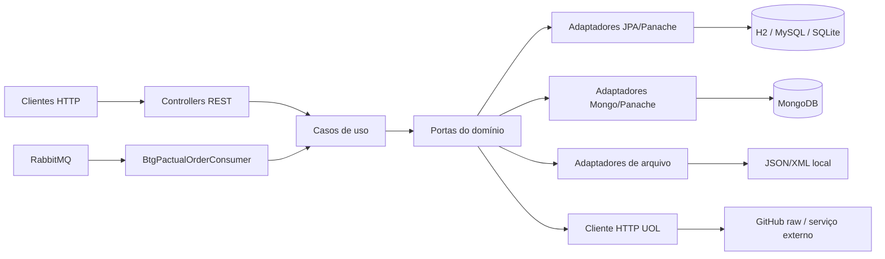
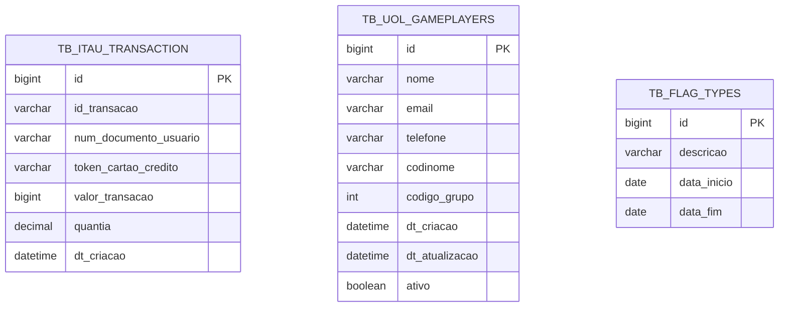
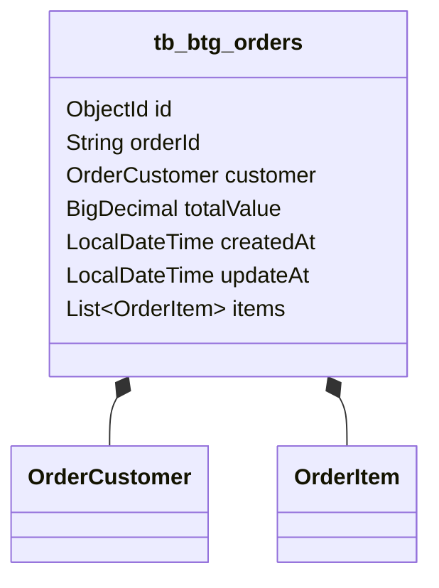
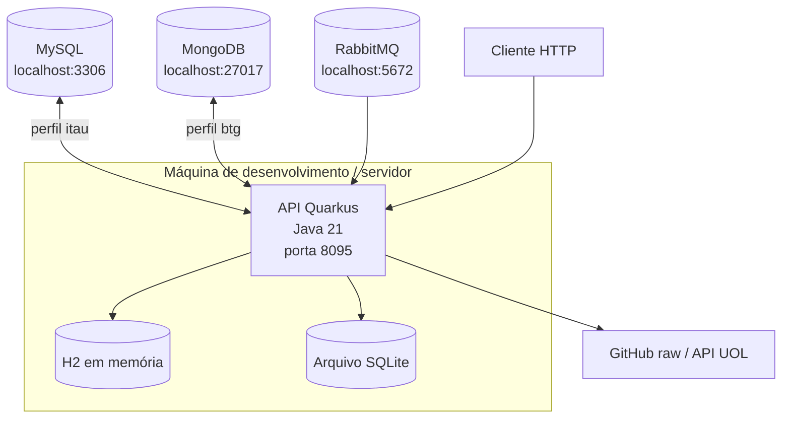

# Relatório técnico final

**Projeto:** `quarkus-overview-chapter-general`  
**Repositório:** [NecoDan/quarkus-overview-chapter-general](https://github.com/NecoDan/quarkus-overview-chapter-general)  
**Data de referência:** 19/09/2026  
**Branch de referência:** `develop`

## 1. Objetivo e escopo

O projeto é uma API de demonstração/aprendizado construída com Quarkus. O escopo realizado reúne três contextos de negócio:

- **Itaú:** criação, consulta, estatísticas e remoção de transações;
- **UOL:** cadastro e consulta de jogadores, com grupo de heróis obtido por arquivo local ou API HTTP;
- **BTG Pactual:** consulta/criação de pedidos em MongoDB e processamento assíncrono de pedidos recebidos por RabbitMQ.

A aplicação expõe endpoints REST, usa casos de uso e portas/adaptadores, possui persistência relacional e documental, integração HTTP externa, leitura de arquivos e mensageria.

## 2. Plano de trabalho: previsto versus realizado

O repositório não contém um plano formal versionado. A tabela abaixo reconstrói o plano técnico a partir da documentação, do código e do histórico de commits; portanto, “previsto” representa o escopo identificável no projeto, e não uma estimativa de cronograma.

| Etapa prevista | Resultado realizado | Situação e justificativa |
|---|---|---|
| Estruturar uma API Quarkus com separação de responsabilidades | Pacotes `core`, `adapter`, `config`, `exceptions` e `utils`, com controllers, casos de uso, portas e adaptadores | **Realizado** |
| Implementar o desafio Itaú | Endpoints de transações e estatísticas, persistência JPA/Panache, perfis MySQL e H2/teste | **Realizado** |
| Implementar o desafio UOL | Cadastro/consulta de jogadores, persistência JPA, arquivos e cliente HTTP para grupos de heróis | **Realizado** |
| Implementar o desafio BTG Pactual | Pedidos em MongoDB/Panache, validações, consultas agregadas e consumo de eventos RabbitMQ | **Realizado** |
| Cobrir o comportamento com testes automatizados | 33 classes de teste e execução da suíte com 174 testes aprovados | **Realizado** |
| Disponibilizar documentação OpenAPI e health checks | Dependências `quarkus-smallrye-openapi` e `quarkus-smallrye-health` presentes; endpoints padrão documentados no README | **Realizado no código** |
| Publicar imagem Docker e infraestrutura cloud | Não há `Dockerfile`, manifests de Kubernetes/Cloud ou evidência de publicação no Docker Hub no repositório | **Não realizado / fora do escopo evidenciado** |
| Reproduzir o build exclusivamente pelo Maven Wrapper | O wrapper existe, mas falta `.mvn/wrapper/maven-wrapper.properties`; o teste foi executado com Maven 3.9.9 instalado | **Desvio**: completar os arquivos do wrapper melhora a reprodutibilidade |

Não foram identificados desvios funcionais que impeçam os três contextos de negócio. O principal desvio operacional é a ausência do arquivo de configuração do Maven Wrapper e a inexistência de uma entrega cloud/Docker registrada.

## 3. Tecnologias, versões e ambiente

| Categoria | Tecnologia |
|---|---|
| Linguagem | Java 21 |
| Framework | Quarkus 3.33.3 |
| Build | Apache Maven 3.9.9; `mvnw`/`mvnw.cmd` versionados, porém sem `maven-wrapper.properties` |
| Persistência relacional | Hibernate ORM Panache, H2, MySQL e SQLite |
| Persistência documental | MongoDB Panache |
| Mensageria | RabbitMQ via SmallRye Reactive Messaging |
| API/serialização | Quarkus REST, Jackson, JSON e XML |
| Validação | Hibernate Validator |
| Testes | JUnit/Quarkus JUnit, Mockito, REST Assured, AssertJ e Mongo embarcado para testes |
| Observabilidade e documentação | Logging JSON, SmallRye Health e SmallRye OpenAPI |
| Sistema operacional verificado | Windows 11, arquitetura amd64 |
| IDE | Não há IDE declarada ou versionada no repositório; a validação deste relatório foi feita via terminal PowerShell e Maven |

As versões de Java, Quarkus e compilação são definidas no [`pom.xml`](../pom.xml).

## 4. Arquitetura da solução

A solução segue uma abordagem de portas e adaptadores, com os controllers e o consumidor de mensagens na entrada, casos de uso no núcleo e adaptadores de persistência/integração na saída.



Principais entradas REST:

- `/itau/transactions` e `/itau/statistics`;
- `/uol/gameplayers`;
- `/btgpactual/orders`.

O perfil ativo no arquivo base é `btg`; perfis adicionais estão disponíveis em `application-itau.properties`, `application-h2db.properties` e `application-sqlitedb.properties`.

## 5. Modelagem do banco de dados

### 5.1 Modelo relacional

As entidades JPA identificadas são:

- `tb_itau_transaction`: transações, identificador da transação, valor, quantidade, data de criação e dados sensíveis armazenados cifrados;
- `tb_uol_gameplayers`: jogadores, nome, e-mail, telefone cifrado, codinome, código do grupo, datas e indicador de ativo;
- entidade de configuração geral `FlagTypeGeneralEntity`, usada pelo repositório de configuração.

O telefone do jogador e os dados sensíveis da transação possuem representação persistida cifrada e campos transitórios para o valor original. As chaves são geradas pelo banco (`IDENTITY`). O perfil H2 usa `drop-and-create`, enquanto MySQL e SQLite usam `update`.



O código não declara relacionamento JPA entre as tabelas; cada contexto é persistido de forma independente.

### 5.2 Modelo documental BTG Pactual

Pedidos são armazenados na coleção MongoDB `tb_btg_orders`. O documento contém `orderId`, `customer`, `totalValue`, `createdAt`, `updateAt` e a lista embutida `items`. O identificador é um `ObjectId`. A configuração habilita a criação automática de índices anotados do Panache Mongo.



## 6. Diagrama de implantação e infraestrutura

O código configura uma implantação local com a aplicação na porta `8095`. Os serviços externos são acessados por rede local; H2 pode ser usado em memória e SQLite em arquivo.



Não foram encontrados arquivos de provisionamento cloud, Docker Compose, Kubernetes, Terraform, pipelines de deploy ou configuração de provedor cloud. Assim, não há infraestrutura cloud a reportar como efetivamente implantada; o diagrama representa somente a topologia suportada pela configuração do código.

## 7. Evidências de testes funcionais

Comando executado no ambiente de validação:

```text
mvn test -DskipITs
```

Resultado observado:

```text
Tests run: 174, Failures: 0, Errors: 0, Skipped: 0
BUILD SUCCESS
Total time: 01:29 min
```

As evidências cobrem controllers REST de Itaú e UOL, consumidor RabbitMQ do BTG, adaptadores de banco, casos de uso, leitura de arquivos, cliente HTTP, entidades e utilitários. Entre os testes há classes `@QuarkusTest`, testes com REST Assured e testes do consumidor com cenários de processamento e erro.

Observação de execução: `mvnw.cmd` não foi executável neste checkout porque o arquivo `.mvn/wrapper/maven-wrapper.properties` não está versionado. A execução acima utilizou o Maven instalado (`Apache Maven 3.9.9`) e Java 21.

## 8. URLs do GitHub e referências

### Repositório e documentação do projeto

- Repositório: https://github.com/NecoDan/quarkus-overview-chapter-general
- Branch de referência: https://github.com/NecoDan/quarkus-overview-chapter-general/tree/develop
- README: https://github.com/NecoDan/quarkus-overview-chapter-general/blob/develop/README.md
- Arquitetura detalhada: https://github.com/NecoDan/quarkus-overview-chapter-general/blob/develop/docs/arquitetura.md
- Arquitetura executiva: https://github.com/NecoDan/quarkus-overview-chapter-general/blob/develop/docs/arquitetura-executiva.md
- Arquitetura técnica: https://github.com/NecoDan/quarkus-overview-chapter-general/blob/develop/docs/arquitetura-tecnica.md
- Implementação detalhada: https://github.com/NecoDan/quarkus-overview-chapter-general/blob/develop/docs/readme-detailed-implementation.md
- Desafio BTG Pactual: https://github.com/NecoDan/quarkus-overview-chapter-general/blob/develop/docs/readme-challenge-btgpactual.md
- Desafio UOL: https://github.com/NecoDan/quarkus-overview-chapter-general/blob/develop/docs/readme-challenge-uolhost.md

### Resumo da documentação de arquitetura

A documentação de arquitetura foi organizada em três níveis para atender diferentes públicos e objetivos:

- `docs/arquitetura.md`: visão completa, técnica e detalhada do sistema, com explicação de camadas, pacotes, fluxos, persistência e diagramas.
- `docs/arquitetura-executiva.md`: visão resumida e estratégica, voltada para apresentação e entendimento geral do desenho arquitetural.
- `docs/arquitetura-tecnica.md`: visão aprofundada do ponto de vista de implementação, com foco em padrões, contextos de negócio, infraestrutura e testabilidade.

Esses documentos complementam o relatório técnico e ajudam a contextualizar a solução em diferentes níveis de profundidade, desde a visão de negócio até a visão de engenharia.

### Referências técnicas usadas

- Quarkus: https://quarkus.io/
- Guia de REST do Quarkus: https://quarkus.io/guides/rest
- Hibernate ORM with Panache: https://quarkus.io/guides/hibernate-orm-panache
- MongoDB with Panache: https://quarkus.io/guides/mongodb-panache
- Messaging RabbitMQ no Quarkus: https://quarkus.io/guides/rabbitmq
- SmallRye OpenAPI: https://quarkus.io/guides/openapi-swaggerui
- SmallRye Health: https://quarkus.io/guides/smallrye-health
- Maven: https://maven.apache.org/

## 9. Docker Hub

Não foi identificada imagem publicada no Docker Hub, nem `Dockerfile` ou URL de imagem nos arquivos do projeto. Portanto, a URL de Docker Hub é **não aplicável para a entrega atual**. A publicação de uma imagem exigiria primeiro definir o empacotamento/container image, o nome do repositório e o pipeline de publicação.
